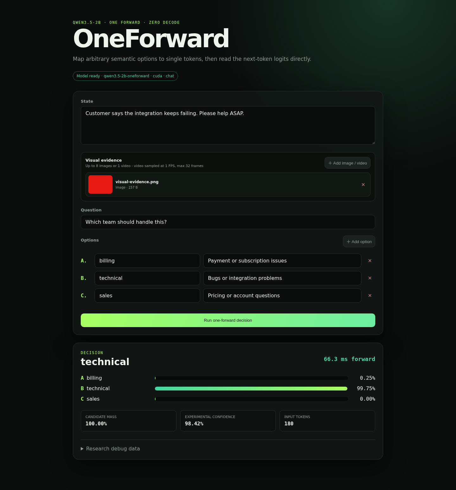

# OneForward

**Zero-training, zero-decoding typed decisions from Qwen3.5-2B logits.**

[](https://www.python.org/)
[](https://huggingface.co/Qwen/Qwen3.5-2B)
[](#no-training-means-no-project-specific-training)
[](LICENSE)

[简体中文](README.zh-CN.md) · [API example](#api) · [How it works](#how-it-works) · [Limitations](#scope-and-limitations)

OneForward turns text, images, and video into typed decisions with the unchanged, open-weight
[Qwen3.5-2B](https://huggingface.co/Qwen/Qwen3.5-2B) checkpoint into a small
Jev-style decision service. It constructs a prompt, maps user-defined options to
single-token labels (`A`–`H`), runs exactly one model forward pass for each
Choice question, and reads the next-token logits directly. There is no decoding
loop, sampling, fine-tuning, adapter, or task-specific checkpoint.

> [!IMPORTANT]
> OneForward is an independent research project inspired by Jev/System One. It
> is not affiliated with or endorsed by TypeSafe AI. It does **not** reproduce
> Jev's proprietary training, calibration, serving stack, speed, or semantics.
> Compatibility is intentionally limited to a useful subset of the public
> Choice-shaped request and response.



## Why this project

- **No additional training.** It uses the upstream Qwen3.5-2B weights unchanged.
- **No generated answer.** A request performs one prefill/forward per question and
  returns `output_tokens: 0`.
- **Native visual evidence.** Attach up to eight images or one video; Qwen's vision
  encoder participates in the same forward pass as the decision prompt.
- **Runtime-defined labels.** Your option names and descriptions are supplied in
  the request; there is no fixed classifier head.
- **Probabilities, not parsed text.** A softmax over the allowed label logits gives
  one probability per option.
- **Inspectable by default.** Raw candidate logits, token IDs, candidate mass,
  the rendered prompt, and the full-vocabulary top tokens are available under
  `_debug`.
- **Self-hosted.** FastAPI, Transformers, and the open-weight Qwen checkpoint are
  the entire stack.

## How it works

For options `billing`, `technical`, and `sales`, the prompt contains:

```text
A. billing: Payment or subscription issues
B. technical: Bugs or integration problems
C. sales: Pricing or account questions

Return exactly one option letter from A, B, C.
```

The Qwen chat template is applied with thinking disabled. If `z` is the final
position's full-vocabulary logit vector and `t_i` is the token ID for option
label `i`, OneForward computes:

```text
p(option_i | allowed options, prompt) = softmax(z[t_i] / temperature)
choice = argmax_i z[t_i]
```

The service also reports `candidate_mass`: the total full-vocabulary probability
assigned to the allowed labels. This catches a failure mode where a distribution
looks decisive *after* renormalizing over A/B/C even though the model did not
actually want to answer with A, B, or C.

At startup, OneForward verifies that every answer label extends the rendered
prompt by exactly one tokenizer token. It fails loudly if a tokenizer or chat
template update breaks that invariant.

## Quick start

Requirements:

- Python 3.10+
- about 4.6 GB for the Qwen3.5-2B checkpoint
- an NVIDIA GPU is recommended; the included CPU fallback is not performance-tested

```bash
git clone https://github.com/Embodied-AI-System/Qwen3.5-OneForward.git
cd Qwen3.5-OneForward

python3 -m venv .venv
source .venv/bin/activate
pip install -U pip
pip install -r requirements.txt

./run.sh
```

The first launch downloads `Qwen/Qwen3.5-2B` from Hugging Face. Open
<http://127.0.0.1:8000> after the model is ready.

Already have the checkpoint locally?

```bash
JEV_MODEL_PATH=/absolute/path/to/Qwen3.5-2B ./run.sh
```

## API

The top-level `media` field is optional, so existing text-only clients continue
to work. Multimodal clients provide base64 data URLs:

```bash
curl http://127.0.0.1:8000/v1/systemone \
  -H 'Content-Type: application/json' \
  -d '{
    "state": "Customer says the integration keeps failing. Please help ASAP.",
    "model": "jev-latest",
    "media": [{
      "type": "image",
      "name": "scene.png",
      "data_url": "data:image/png;base64,..."
    }],
    "questions": {
      "department": {
        "type": "choice",
        "instructions": "Which team should handle this?",
        "criteria": {
          "billing": "Payment or subscription issues",
          "technical": "Bugs or integration problems",
          "sales": "Pricing or account questions"
        }
      }
    }
  }'
```

Example response, abbreviated from a real BF16 run:

```json
{
  "model": "qwen3.5-2b-oneforward",
  "answers": {
    "department": {
      "type": "choice",
      "choice": "technical",
      "confidence": 0.9824429196,
      "probabilities": {
        "billing": 0.0028009214,
        "technical": 0.9971970320,
        "sales": 0.0000019891
      },
      "_debug": {
        "candidate_mass": 0.9998436570,
        "input_tokens": 114
      }
    }
  },
  "usage": {"input_tokens": 114, "output_tokens": 0},
  "_compat": {
    "schema_scope": "choice-only",
    "semantic_compatibility": false,
    "confidence_method": "one_minus_normalized_entropy_experimental"
  }
}
```

Multiple Choice questions are accepted in one request, but this first version
evaluates them sequentially—one model forward per question.

The browser playground supports selecting or dragging files with inline preview.
The API accepts PNG, JPEG, WebP, GIF, MP4, WebM, MOV, MKV, and AVI data URLs.
Images are limited to 16 MiB each. Video is limited to 64 MiB and 180 seconds,
sampled at 1 FPS with a 32-frame cap. Base64 content is decoded locally and is
never echoed in responses; only dimensions, byte size, duration, and sampled
frame count appear under `_debug.media`.

## Configuration

| Variable | Default | Meaning |
| --- | --- | --- |
| `JEV_MODEL_PATH` | `Qwen/Qwen3.5-2B` | Hugging Face model ID or local checkpoint directory |
| `JEV_DEVICE` | `cuda` when available, otherwise `cpu` | PyTorch device |
| `JEV_PROMPT_MODE` | `chat` | `chat` uses Qwen's template; `raw` uses an `Answer:` completion prompt |
| `JEV_TEMPERATURE` | `1.0` | Rescales candidate logits; no sampling is performed |
| `JEV_MAX_INPUT_TOKENS` | `8192` | Maximum text-plus-vision token count |
| `JEV_VIDEO_FPS` | `1.0` | Target video sampling rate |
| `JEV_MAX_VIDEO_FRAMES` | `32` | Maximum sampled frames per video |
| `JEV_HOST` | `127.0.0.1` | Bind address |
| `JEV_PORT` | `8000` | HTTP port |
| `JEV_PYTHON` | `python3` | Python executable used by `run.sh` |

## Tests

```bash
PYTHONPATH=. python -m unittest discover -s tests -v
python -m compileall -q app.py core.py inference.py media.py tests scripts
```

After starting the server, run the real-model smoke request:

```bash
./scripts/smoke_test.py
```

## No training means no project-specific training

This repository does not train or modify model weights. It adds prompt
construction, one-token candidate validation, logit selection, probability
normalization, an HTTP API, and a browser UI around the official
`Qwen/Qwen3.5-2B` checkpoint.

The upstream Qwen3.5-2B checkpoint is itself Qwen's **post-trained** model. The
claim here is precise: OneForward performs no *additional* fine-tuning,
post-training, RL, distillation, or calibration.

## Scope and limitations

- Choice only, with 2–8 options. Noul, Score, and larger option sets are not
  implemented.
- Multimodal input requires chat prompt mode; the raw `Answer:` baseline remains
  text-only.
- Each request accepts up to eight attachments and at most one video. Video is
  frame-sampled and audio is ignored.
- Questions are not batched and do not share a prefix cache.
- Candidate probabilities are conditional on the allowed labels and are not
  calibrated correctness probabilities.
- `confidence = 1 - normalized_entropy(probabilities)` is an experimental
  heuristic, not Jev's confidence calculation.
- Option order and label-token choice can bias results. Evaluate permutations on
  your own labeled data before using thresholds.
- The included examples are smoke tests, not an accuracy or calibration benchmark.
- There is no authentication, rate limiting, or production hardening.

Do not use this research preview for high-stakes or irreversible decisions
without domain-specific evaluation and human safeguards.

## Project layout

```text
app.py              FastAPI request/response layer
core.py             prompt rendering and probability utilities
inference.py        Qwen loading and final-position logits readout
media.py            validated data-URL decoding and bounded video sampling
web/                local research playground
tests/              schema and tokenizer-invariant tests
scripts/smoke_test.py
```

## Contributing

Bug reports, reproducible evaluations, calibration studies, batching work, and
support for additional open models are welcome. See [CONTRIBUTING.md](CONTRIBUTING.md).

## License and attribution

The code in this repository is released under the [Apache License 2.0](LICENSE).
The Qwen3.5-2B weights are not included and remain governed by the
[Qwen3.5-2B license](https://huggingface.co/Qwen/Qwen3.5-2B/blob/main/LICENSE).

Jev and System One are referenced only to describe the interface pattern that
inspired this independent experiment. All related names and marks belong to
their respective owners.

## Acknowledgements

- [Qwen3.5-2B](https://huggingface.co/Qwen/Qwen3.5-2B), the unchanged open-weight model used here
- [TypeSafe AI SDK](https://github.com/typesafe-ai/typesafe-sdk-python), for the public typed-decision interface that inspired this experiment
